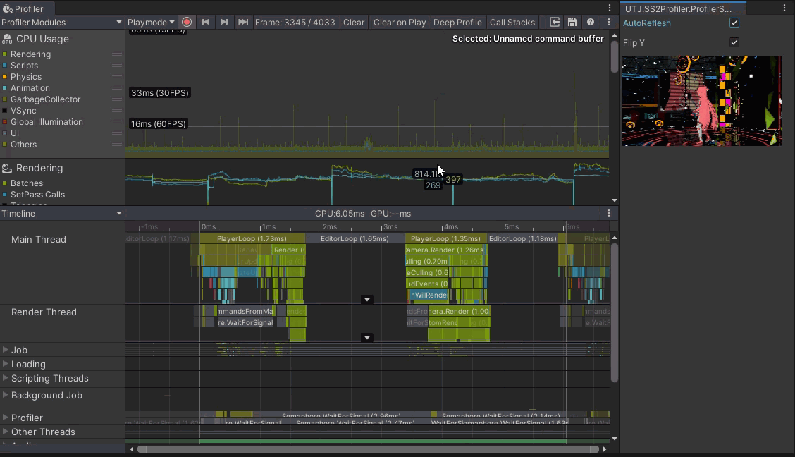
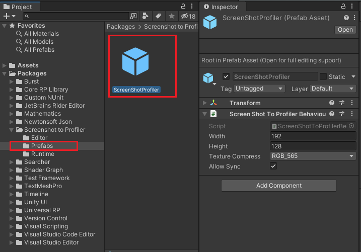

# ScreenshotToUnityProfiler

[](https://openupm.com/packages/com.utj.screenshot2profiler/)
<br />
[日本語はコチラ](README.ja.md)<br />

## about
Embed Screenshot to Unity Profiler protocol.<br />


## requirement
- 2019.3 or newer.<br />

## reccomend
- the platforms that supports System.supportsAsyncGPUReadback (Mobile vulkan or metal....)<br />
 Support sync readback from 1.1.0 , however it's very slow....<br />

## install

via [OpenUPM](https://openupm.com/packages/com.utj.screenshot2profiler/) (requires [openupm-cli](https://github.com/openupm/openupm-cli#openupm-cli)).

```
openupm add com.utj.screenshot2profiler
```

## how to use
1.Initialize. <br />
Place the "ScreenShotProfiler.prefab" to the scene.<br />
<br />
(You can customize the settings at Inspector.)<br />

or callling this method to Initialize.
UTJ.SS2Profiler.ScreenShotToProfiler.Instance.Initialize(); <br />
or <br />
UTJ.SS2Profiler.ScreenShotToProfiler.Instance.Initialize(w,h);<br />
( w,h means recording texture size).

2.call "Tools -> ProfilerScreenshot" from Menu. <br />
And then window will be displayed.

### Capture specific image instead of ScreenCapture
This is a sample that use RenderTexture instead of ScreenCapture.
```
RenderTexture captureRenderTexture;

ScreenShotToProfiler.Instance.captureBehaviour = (target) => {
    CommandBuffer commandBuffer = new CommandBuffer();
    commandBuffer.name = "ScreenCapture";
    commandBuffer.Blit(captureRenderTexture, target);
    Graphics.ExecuteCommandBuffer(commandBuffer);
};
```
[Whole Sample Code](Sample~/SwitchSample.cs)<br />


## change
<pre>
version 1.2.0
  fix NullError when there is no data in Profiler.
  add Texture compress option.
  add RenderTexture capture instead of Screenshot.
  add "ScreenshotToUnityProfiler.prefab"

version 1.1.0
  add sync readback option for gles.
</pre>
